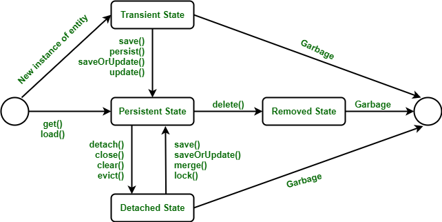

#  Hibernate ORM Code Space

  Welcome to Hibernate ORM Code Space! 
  Here, you'll delve into fundamental Hibernate theories through meticulously crafted code examples organized into distinct branches. 
  Embark on a journey of learning and mastery within the realm of Hibernate ORM.

## Table of Contents

- [Lessons](#Lessons)
  - [Lesson-01](#Lesson-01)
  - [Lesson-02](#Lesson-02)
  - [Lesson-03](#Lesson-03)
  - [Lesson-04](#Lesson-04)
  - [Lesson-05](#Lesson-05)
- [Hibernate_Life_Cycle](#Hibernate_Life_Cycle)
- [Usage](#Usage)
- [License](#license)

## Lessons

### Lesson-01

<ul>
  <li>Explore Object-Oriented Programming (OOP) concepts through insightful coding examples.</li>
  <li>
    
To access the content:

    <ul>
      <li>Navigate to the <strong>lesson/Day_01</strong> branch to review the source code.</li>
      <li>Alternatively, clone the repository specifically from the <strong>lesson/Day_01</strong> branch using the following command:</li>
    </ul>
    <pre><code>git clone -b lesson/Day_01 --single-branch https://github.com/gayanukabulegoda/Hibernate-ORM-Lesson.git</code></pre>
  </li>
</ul>

### Lesson-02

<ul>
  <li>Explore Hibernate XML Mapping and Property File Mapping for advanced insights into Object-Relational Mapping.</li>
  <li>
    
To access the content:

    <ul>
      <li>Navigate to the <strong>lesson/Day_02</strong> branch to review the source code.</li>
      <li>Alternatively, clone the repository specifically from the <strong>lesson/Day_02</strong> branch using the following command:</li>
    </ul>
    <pre><code>git clone -b lesson/Day_02 --single-branch https://github.com/gayanukabulegoda/Hibernate-ORM-Lesson.git</code></pre>
  </li>
</ul>

### Lesson-03

<ul>
  <li>Explore fundamental topics in Hibernate, covering CRUD implementation, Session Factory setup, hbm2ddl.auto configurations, and Hibernate annotations.</li>
  <li>
    
To access the content:

    <ul>
      <li>Navigate to the <strong>lesson/Day_03</strong> branch to review the source code.</li>
      <li>Alternatively, clone the repository specifically from the <strong>lesson/Day_03</strong> branch using the following command:</li>
    </ul>
    <pre><code>git clone -b lesson/Day_03 --single-branch https://github.com/gayanukabulegoda/Hibernate-ORM-Lesson.git</code></pre>
  </li>
</ul>

### Lesson-04

<ul>
  <li>
    Discover key Hibernate concepts including configuration object implementation, 
    repository layer setup, schema generation, differentiation between the get() and load() methods, 
    and operation of Hibernate query object.
  </li>
  <li>
    
To access the content:

    <ul>
      <li>Navigate to the <strong>lesson/Day_04</strong> branch to review the source code.</li>
      <li>Alternatively, clone the repository specifically from the <strong>lesson/Day_04</strong> branch using the following command:</li>
    </ul>
    <pre><code>git clone -b lesson/Day_04 --single-branch https://github.com/gayanukabulegoda/Hibernate-ORM-Lesson.git</code></pre>
  </li>
</ul>

### Lesson-05

<ul>
  <li>
    Explore essential topics such as JPQL and HQL custom queries, constructor projection, 
    and the Hibernate life cycle encompassing transient, persistent, detached, and removed states.
  </li>
  <li>
    
To access the content:

    <ul>
      <li>Navigate to the <strong>lesson/Day_05</strong> branch to review the source code.</li>
      <li>Alternatively, clone the repository specifically from the <strong>lesson/Day_05</strong> branch using the following command:</li>
    </ul>
    <pre><code>git clone -b lesson/Day_05 --single-branch https://github.com/gayanukabulegoda/Hibernate-ORM-Lesson.git</code></pre>
  </li>
</ul>

## Hibernate_Life_Cycle

 

## Usage

To run the project, follow these steps:

<ol>
  <li>Open the project in your IDE.</li>
  <li>
    Build and run the application.
    <ul>
      <li>(Ensure that your system has Java versions 8, 11, 17, or 18 installed.)</li>
    </ul>
  </li>
</ol>

## License

This project is licensed under [MIT License](LICENSE).

##

  

  &copy; 2024 Gayanuka Bulegoda

